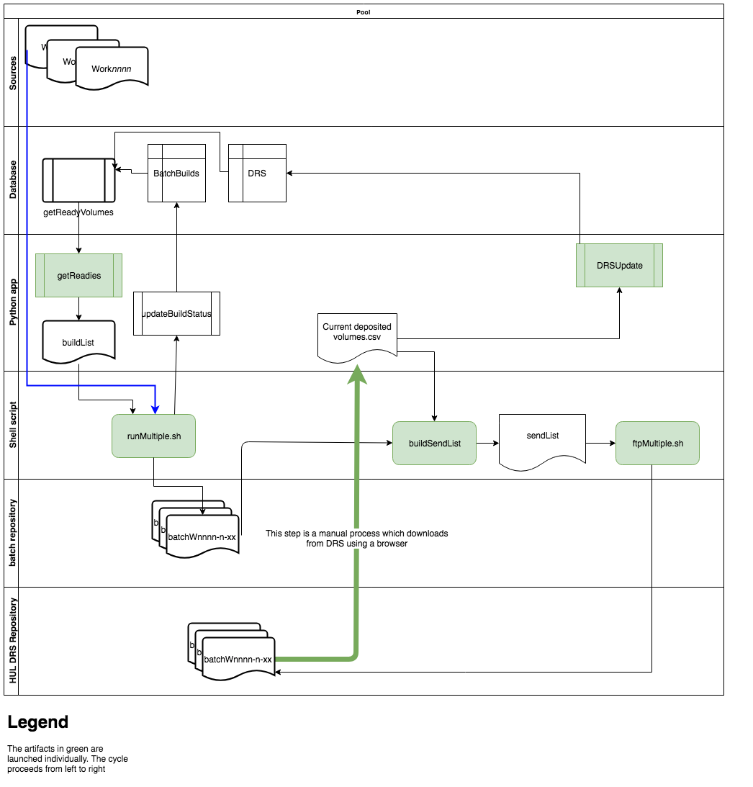
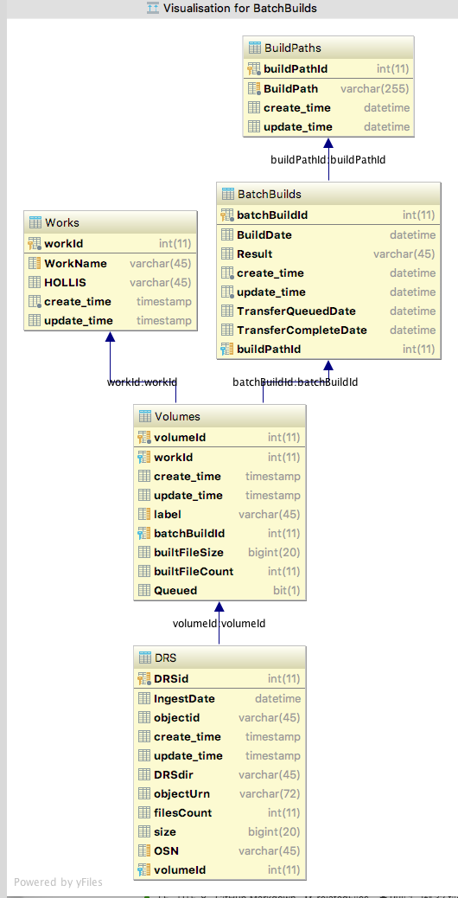
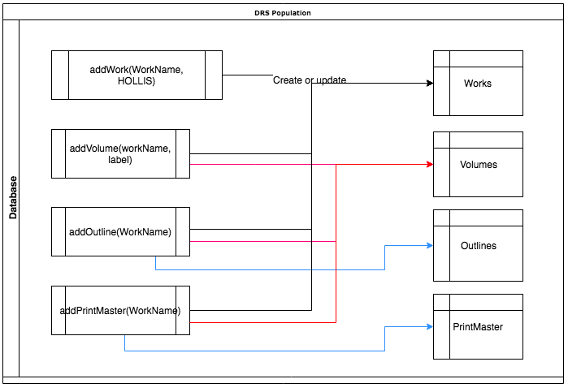

# DRS Design Overview
## Introduction
This document describes at a high level the APIs and supporting data which implement the DRS Batch Building and Deposit processes
### Related Documents:
1. [Batch Building](BatchBuilding.md): User reference for creating batches.
1. [Deposit Workflow](DepositWorkflow.md): User reference to depositing built batches.
1. [Recovery](Recovery.md): User reference for retrying failed batches.
2. [Related Files Design](RelatedFilesDesign.md): Design document for processing outlines and Print masters.

### Intended audience
BDRC Management and technical staff.

## Architectural Overview
### Environments
The principal components of the DRS system are:
* File systems, which store
	- Image sources
	- Built Batches
* Shell scripts, which act on file systems. Generally driven by data lists, most often implemented as CSV files.
* Python scripts, which interact with the database
* DRS database, hosted in AWS, which stores state

### Denomination
The most important unit in the DRS system is a **Volume**, by which we mean one identifiable subset of a work. Volumes are found in the `images` subdirectory of a work's Image source. For example:

```
$ ls -1 /Volumes/Archive/W00CHZ0103340/images
W00CHZ0103340-I1CZ30
W00CHZ0103340-I1CZ31
W00CHZ0103340-I1CZ32
W00CHZ0103340-I1CZ33
```
The batch building process transforms each volume into an object, which is the key field for deposits.
For that reason, all the state information in the database (batch builds, deposits, etc) is dimensioned by volume. Works information is aggregated from the Volume --> Work relationship.

### Workflow
The entire workflow, which highlights the relations between the various object, is shown here:

Please refer to [Related files Design Document](RelatedFilesDesign.md) for details.
### Sequence
The temporal implementation is shown here: Objects in green represent entry points into the process: some of them are scripts, one is a Python script, and one is a browser search and download. Please refer to the Related documents section above for user instructions

The entry points into the system reflect two separate, yet equally important paths:
* Building batches
* Depositing built Batches

#### Building Batches
1. `getReadies` This python script gets the next set of works to be batch built.
2. `splitWorks` This python script splits the output of `getReadies` into work lists.
3. `runMultiple.sh` Generates processes and logging for each of the work lists that `splitWorks` has generated

#### Depositing Batches
1. Get total list of deposits (this is the manual process shown below above). Output is`Current Deposited Volumes.csv`
2. `buildSendList` Use the `Current deposited Volumes` and the batch repository builds to derive the next tranche of batch builds to upload.[^e58abf][^4e8fa9]
3. `ftpMultiple.sh` Sets up sessions and logging to parallel upload the output of `buildSendList` above.


[^e58abf]: Right now, this process uses the file system. It should use the database instead, for speed.

[^4e8fa9]: There is a recovery step, which retries failed deposits. Omitted for simplicity.
### Database
#### Tables

The database reflects the centrality of the Volume.
#### Views
* `AllReadyWorks` contains the set of Volumes which is ready for deposit. Before Outlines and Print Masters, this view restricted the list of ready works to those without outlines or print masters. This view implements the business requirements of "readiness."
* `ReadyWorksNotDeposited` This is the set of ready works which has not been deposited.

#### Routines
##### Population
These routines create the objects which will be processed:
* `AddWork`
* `AddVolume`
* `AddOutline`
* `AddPrintMaster`



As a rule, they create the parent object if it does not exist. These routines only use text data - no keys are exposed to the user.

##### Source generation
* `GetReadyVolumes` Build the list of volumes which are ready to batch build. The output structure reflects the needs of the shell script which builds the batches, and marks a Volume as `Queued` so that subsequent calls return different results.
##### State change
These routines change the state of the database to reflect batch building and DRS deposit. Generally, they are accessed through python modules which the batch building process calls.
* `UpdateBatchBuild` updates the batch build table, and adds build information (such as file count and total size) for each volume. The data is calculated by the Python module `updateBuildStatus`
* `AddDRS` Adds a record to the `DRS` table, which records the deposit information for a volume.

### Python modules
These Python modules are the interface into the Database
* `getReadies` Gets the next _n_ batches to build
* `updateBuildStatus` this is called after a batch has been built. It calculates some values, and passes the result to the database (`UpdateBatchBuild`)
* `DRSUpdate` updates the deposit records in the database. Usually called against an incremental list of the "Current deposited  volumes.:"
*
### Shell scripts
These are the two outermost shell scripts, which setup and launch parallel subtasks:
* `runMultiple.sh` Starts the batch building processes.
* `ftpMultiple.sh` Starts the DRS upload processes. Once the files are uploaded, the HUL DRS system completes the deposit.

### Manual processes
There is only one user interface process, which downloads the cumulative llist of  downloads (and an incremental list of a recent period's downloads, for DRSUpdate)
