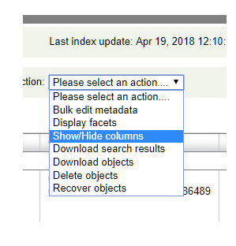
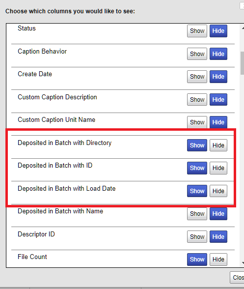

# Deposit workflow

## Executive Summary
* Clean up (recover) prior deposit run errors
* download results from prior deposit run errors
* Generate list of all available batches
* Filter out all uploaded batches (using downloaded results)
* Extract todays deposit file limit from batches including recovery batch file counts.
## Assumptions:
### Environment
You don't need the entire drs-deposit project, just the folder DRS-BATCH-PROCESSING and its subdirectories. you might want to put those paths into your PATH, or to link them in a common dir on your path.
You will also need to link, or add to your path, the `parallelBatch` subdirectory.
#### Environment variables:
**You need these set for anything to work**
`export PR=/Volumes/DRS_Staging/DRS/prod`  This is the parent of all batch builds.
`export CODE=<root of drs-deposit git repository>/DRS-BATCH-PROCESSING`
### Temporary assumptions, to change as uploads continue
Any work to deposit does not require links to it - that means (for now)
no print masters or outlines. This is taken care of in the drs-deposit/output/NoPrintNoOutline.csv
## Special circumstances
Sometimes, you might need loads from a different day, that have not had their LOADREPORTS downloaded.
It's possible, desirable even, to re-run deposit records from prior days.
## Preparation for today's deposits

### Get Yesterdays results from DRS WebAdmin
An earlier version of the workflow used the existence of LOADREPORTS on disk to determine which works had been uploaded. This workflow uses the output of a DRS WebAdmin search. Details to follow.
** IMPORTANT ** When you do the search, be sure to add the column "Batch Directory" to the output columns.


_Getting the 'Deposited in Batch with Name' might be helpful, but is not required_
** Current workflow downloads everything **


#### Download yesterdays loadreports
In the directory you made the on the last day you uploaded,  look for the file _sourceFileList_.UploadTrack.lst. It contains a separated list of users and the sources of the batches they deposited. A typical run is
```
drs2_tbrcftp|20180405DepositList1.txt
drs2_tbrcftp1|20180405DepositList2.txt
drs2_tbrcftp2|20180405DepositList3.txt
drs2_tbrcftp3|20180405DepositList4.txt
drs2_tbrcftp|20180405DepositList1.txt
drs2_tbrcftp|20180405DepositList1.txt
```
Each line decomposes into an argument list for pollDRS.sh. Use `ProcessTrackFile.sh` to turn this into a download script using `pollDRS.sh`


#### pollDRS.sh
```
Usage: pollDRS.sh uploadedBatchList remoteUser reportDir where
        uploadedBatchList       is the file list containing the list of directories.
                                        This file can be the same as the upload list (/path/to/batches/batchnnn-1)
                                        or it can be just a list of batches (BatchW.....-1)
        remoteUser              is the user on the remote system
        reportDir               is the directory which will receive the remote logs

```
It's most common use is to download the results of batches which were uploaded, and were defined in the `uploadedBatchList` parameter.
### Fix up yesterdays deposits
Correct and restart or reload any deposits you may have received.
You can use the existence of a downloaded `batch.xml.failed` to infer a deposit error, but it is by no means certain (a deposit directory can have both LOADREPORT and `batch.xml.failed` files). As well, the downloaded files do not tell you the error. You have to examine your emails for that. (I find it usedful just to dump the previous )
I collect and parse the emails on the build machine. It's best to make several passes, one for each kind of error.

In your mail app, select messages with each specific text.[^88fae8cf] For example,
* 'Object owner supplied name' - this means the object exists.
* 'JDBCException' - is a temporary resource failure
* 'MD5 checksum' error. - this requires recovery: what's happened is that the DRS ingest failed, and the retry failed as well. See below for cause and remediation.
*  '/drs/drsfs/descriptor/.... (Permission denied)' - this is also a transient error.
* ' Could not create PROCESSING .. because directory is unwritable' - this is a more serious error with its own workflow.
#### Error classification
There are three distinct workflows for errors

[^88fae8cf]: My exoerience has been that this is best done on a MacOS mail client. On Windows, doing this and ftp'ing it has \n side effects.

Error Type|Error Text|Fix type
----|-----|------
Duplicate deposit|'Object Owner supplied name exists'|[workflow]('Object Owner supplied name exists')
DRS permissions failure  |'Could not create PROCESSING'|Inhibit further PROCESSING
Everything else|varies|recover the batch using workflow ???? below
  |   |  


### Error resolution workflows
#### Workflow 'Object Owner supplied name exists'
Fix these first. When you download batch results, you don't want these in your downloads. These occur because of absences in the deposit records. Go to WebAdmin and refresh the deposit batches. (TODO: Document the procedure)
The fix is to go into an SFTP UI (FileZilla or  BitVise), and delete the directory in the UI. This is a very tedious and slow procedure.

Steps:
1. Search emails for 'Object Owner supplied name exists' Save into a text file.
2. grep the text file for `\(Batch Directory\|Dropbox User\)`
You should get a sequence of
```
Dropbox User: drs2drs2_tbrcftp
Batch Directory:batchWnnnnn-m
```
3. For each user, open an SFTP ui and delete `/incoming/batchWnnnnn-m`

**Note: the directory could have both a batch.xml.failed and a LOADREPORT. If it has a LOADREPORT, just delete the batch.xml.failed and the other directory (Wnnnnn-Immmmmm)**
#### Workflow Inhibit further PROCESSING
The first two steps are the same as the above workflow.
1. Search emails for 'Object Owner supplied name exists' Save into a text file.
2. grep the text file for `\(Batch Directory\|Dropbox User\)`
3. Next ** VERY IMPORTANT ** Email drs-support with the grep output. They will address the underlying problem and will let you know when these directories can be reset to build.
3. Group these into files of batches, one file for each user.
4. Process these through ` FixUnwritableRemotePath.sh`
```
Usage: FixUnwritableRemotePath.sh remoteUser
where
        remoteUser  is the user on the remote system who owns the files.
        list of remote directories is read from input
```
Since this process responds to a fire, it immediately runs `sftp` to change each directory's `batch.xml` to `batch.xml.wait` This prevents DRS from ingesting them. Once DRS has done this, you run `ResetUnwritableDirectories.sh` to set them ready to be ingested.
#### Have any errors been resolved?
1. Determine what's been published. `~/drs-deposit/output/WebAdminDepList.csv` keeps a running total of what we've deposited. `cut -f10 -d, | sort -u` to get the list of batches (you need the unique because a work can span deposits) (Nerd note: although the batch directory name is heading 9, one of the data fields has a , in it.)
2. Derive the errored batches `grep 'Batch Directory' ` _all your error files_
This gives the batch ids of the failures. `sort -u` to filter out duplicates.
From the repository, get all the batch ids of what's deposited
#### JDBC Exception
This is a transient exception caused by DRS ingest. The fix is to use
`BuildRecoveryList.awk`
```
Usage:  BuildRecoveryList -v ARG_OUTDIR=outDirName -v ARG_PREFIX=argPrefix -V ARG_SRCS=filePattern dataFile
where
	ARG_OUTDIR = destination directory for sets of sftp scripts
    ARG_PREFIX is the prefix for sftp scripts
    ARG_SRCS is the filespec for a set of files which are parsed for batch names to recover - metacharacters must be quoted. such as *   ARG_SRCS='frelm*' to search in all files whose name begins with frelm
    dataFile is a list of batch NAMES (batchWnnnn-m). Can be free form, but you have to modify the main loop to pass in the batch name.
```
`BuildRecoveryList.awk` creates a directory (ARG_OUTDIR) of sftp scripts whose names are prefixed with ARG_PREFIX. These batch scripts recover a failed build correctly by uploading all the "descriptor.xml" files in the batch, and then, finally, the batch.xml file. This awkward (sorry) process is needed because the DRS process modifies descriptor files during the ingestion process. When it fails, if you only rename or upload batch.xml, you get the MD5 checksum error (batch.xml contains checksums for its descriptor.xml files, and the checksums won't match after DRS has changed the descriptor files).


** IMPORTANT DO NOT POLL FOR RESULTS RIGHT AWAY ** This can interfere with the DRS process.
## Todays uploads
After the recovered batches are built, go into WebAdmin and download a csv of the results. `RemoveDepositedBatchPaths.sh` knows how to parse this for batch directory names.
### Make a new directory
`cd $DEPOSIT_ROOT`
mkdir Something. This can be anything meaningful. It could be a yyyymmdd, anything.
### Capture all the builds
`$CODE/RemoveDuplicateBuilds.sh` to generate a canonical list of all builds.
(In a future, this will have deposits removed)
gives you the file `BuildList.txt`
### Remove the deposits from the list
let `DEPOSIT_ROOT=/Volumes/DRS_Staging/DRS/KhyungUploads/prod/`
this is embedded in `$CODE/RemoveDepositedBatchPaths.sh`, which you run.
This gives you a `UnDepositedBuildPaths.txt` and a `DictUnDepositedBuildPaths.txt`

These files are:
* `UnDepositedBuildPaths.txt`: the set of deposited batches as calculated by all the LOADREPORTS found in the prod (by running `pollDRS.sh` in every daily run directory. **This method is on probation. The WebAdmin dctionary is the provisional authority **
* `DictUnDepositedBuildPaths.txt`: the set of deposited batches as calculated by the DRS WebAdmin dictionary
### Calculate how many of these you can deposit
There's a script file, `~/drs-deposit/DRS-BATCH-PROCESSING/CountFilesInBatches.awk` which you can paste into a script, to calculate all the files in a list of batches. you can inline the script like this:
```
while read gg ; do awk ' { cmd = "find $(dirname " $1 ") -type f | wc -l"
cmd | getline thisCount
close(cmd)
sumCount += thisCount
print $1 "|" thisCount "|" sumCount }' ; done < DictUnDepositedBuildPaths.txt
```
Save that to a file, and then find the number that's before 250000 (less any repair builds you've set up earlier)
For example
`/Volumes/DRS_Staging/DRS/prod/20180402/worksList6.15.03/batchW18579-1/batch.xml|     480|242505`
Then you can just stream that out to your source file
`sed -n -e '1,/242505/p'   CumList.txt  | cut -f1 -d'|' > DoThisNow.txt`
and take it out of the original list
`sed -n '/242505/,$p' CumList.txt | cut -f1 -d'|' > AfterFirstTranchePaths.txt`
Generally, I don't re-use this index, I rebuild it every day, to allow for possible new builds
and new downloads.
### Prepare a list for ftpMultiple.sh
`DoThisNow.txt`has the full path to batch.xml files, and`ftpMultiple.sh`
only uses the batch.xml containing folder. You can either
* read DoThisNow.txt, and transform each line with basename
`while read dd ; do dirname $dd ; done <tmptmp > DoTheseNow.txt`
* Just strip out the batch.xml when you build DoThisNow.txt
`sed -n `-e '1,/242505/p' -e 's/\/batch.xml//' CumList.txt  | cut -f1 -d'|' > DoThisNow.txt`
### Run ftpMultiple.sh
** Helpful to run this in a tmux window, so you can peek the status remotely. **
You won't get email notifications of success, only failure.
** DONT PEEK ** There's a strong suspicion that opening an SFTP UI onto the servers degrades its performance and generates lots of spurious errors.
